# Automated Refactoring Pipeline - Pipeline Flowchart

This document provides the flowchart for the automated refactoring pipeline.

## Main Pipeline Architecture

```mermaid
flowchart TB
    subgraph Trigger["⏰ Trigger Layer"]
        SCHEDULE["Scheduled Trigger<br/>(cron: daily/weekly)"]
        MANUAL["Manual Trigger<br/>(workflow_dispatch)"]
    end
    
    subgraph Detection["🔍 Detection Module"]
        FETCH["Fetch Repository Files"]
        FILTER["Filter Target Files<br/>(Java files, exclude tests)"]
        
        subgraph SmellDetection["Design Smell Detection"]
            STATIC["Static Analysis<br/>(AST parsing, metrics)"]
            LLM_DETECT["LLM-based Detection<br/>(pattern recognition)"]
        end
        
        PRIORITIZE["Prioritize Smells<br/>(severity scoring)"]
    end
    
    subgraph LargeFileHandler["📄 Large File Handler"]
        CHECK_SIZE{"File Size<br/>Check"}
        CHUNK["Chunk into Segments<br/>(~500 lines each)"]
        CONTEXT["Add Context Headers<br/>(imports, class structure)"]
        FULL_FILE["Process Full File"]
    end
    
    subgraph Refactoring["🔧 Refactoring Module"]
        LLM_REFACTOR["LLM Refactoring<br/>(Gemini API)"]
        VALIDATE["Validate Suggestions<br/>(syntax check)"]
        DOCUMENT["Generate Refactoring<br/>Documentation"]
    end
    
    subgraph PRGeneration["📝 PR Generation Module"]
        CREATE_BRANCH["Create Feature Branch"]
        COMMIT_DOCS["Commit Documentation<br/>(NOT code changes)"]
        CREATE_PR["Create Pull Request"]
        ADD_DETAILS["Add PR Description<br/>(smells, techniques, metrics)"]
    end
    
    subgraph Output["✅ Output"]
        PR["Pull Request with:<br/>• Detected Smells<br/>• Suggested Refactorings<br/>• Metrics & Analysis"]
    end
    
    SCHEDULE --> FETCH
    MANUAL --> FETCH
    FETCH --> FILTER
    FILTER --> STATIC
    STATIC --> LLM_DETECT
    LLM_DETECT --> PRIORITIZE
    PRIORITIZE --> CHECK_SIZE
    
    CHECK_SIZE -->|"≤ 500 lines"| FULL_FILE
    CHECK_SIZE -->|"> 500 lines"| CHUNK
    CHUNK --> CONTEXT
    CONTEXT --> LLM_REFACTOR
    FULL_FILE --> LLM_REFACTOR
    
    LLM_REFACTOR --> VALIDATE
    VALIDATE --> DOCUMENT
    
    DOCUMENT --> CREATE_BRANCH
    CREATE_BRANCH --> COMMIT_DOCS
    COMMIT_DOCS --> CREATE_PR
    CREATE_PR --> ADD_DETAILS
    ADD_DETAILS --> PR
```

## Large File Handling Strategy

```mermaid
flowchart LR
    subgraph Input["Large File (>500 lines)"]
        FILE["FullFile.java<br/>(e.g., 1500 lines)"]
    end
    
    subgraph Processing["Chunking Process"]
        EXTRACT["Extract Structure:<br/>• Package declaration<br/>• Imports<br/>• Class signature"]
        
        SPLIT["Split into Chunks:<br/>• Chunk 1: L1-500<br/>• Chunk 2: L501-1000<br/>• Chunk 3: L1001-1500"]
        
        CONTEXT_ADD["Add Context to Each:<br/>// FILE: FullFile.java<br/>// CHUNK: 2/3 (L501-1000)<br/>// CONTEXT: [imports...]"]
    end
    
    subgraph LLM["LLM Processing"]
        PROCESS1["Process Chunk 1"]
        PROCESS2["Process Chunk 2"]
        PROCESS3["Process Chunk 3"]
    end
    
    subgraph Merge["Result Merge"]
        COMBINE["Combine Findings"]
        DEDUPE["Deduplicate"]
        FINAL["Final Report"]
    end
    
    FILE --> EXTRACT
    EXTRACT --> SPLIT
    SPLIT --> CONTEXT_ADD
    CONTEXT_ADD --> PROCESS1
    CONTEXT_ADD --> PROCESS2
    CONTEXT_ADD --> PROCESS3
    PROCESS1 --> COMBINE
    PROCESS2 --> COMBINE
    PROCESS3 --> COMBINE
    COMBINE --> DEDUPE
    DEDUPE --> FINAL
```

## Module Interaction

